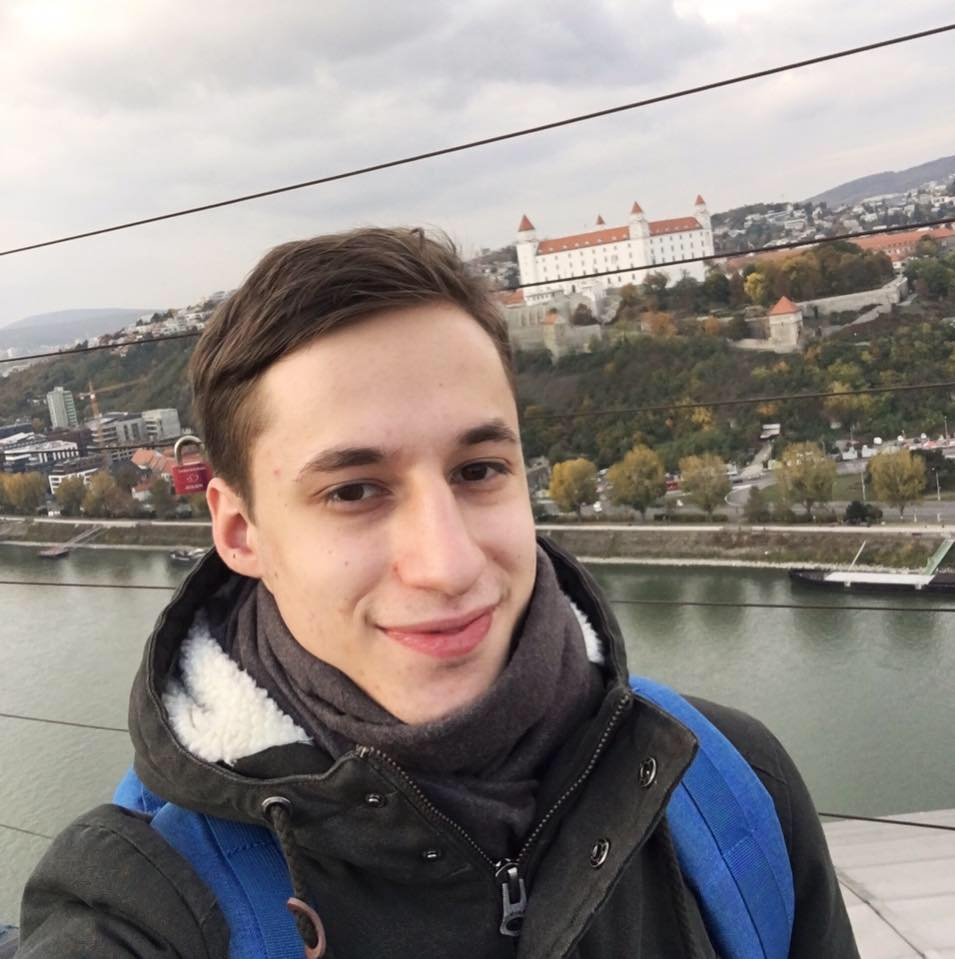
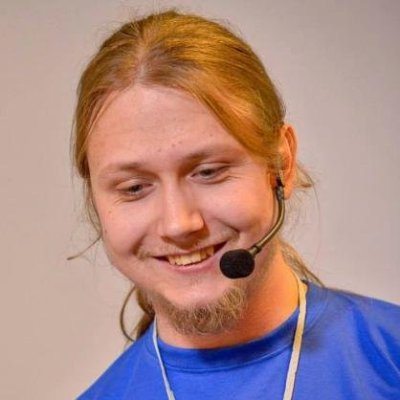
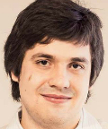

  - # 
  - [Twitter](https://twitter.com/kyivjs)
  - [Gitter](https://gitter.im/dev-ua/frontend-ua/kyivjs)
  - [Регистрация   Скоро откроется]()

## Следующая встреча: 11 февраля, 2017
<!--
[Донская 4а](https://maps.yandex.ua/-/CVw9rZop) - - - [Digital Future](http://digital-future.org/) + [The App Solutions](http://theappsolutions.com/)
- 

  >
    [**who**]()
    [what]()
-->
11:00, [Горизонт-Парк башня 2, ул. Николая Амосова, 12](https://yandex.ru/maps/-/CZT3UNIX) - [Ciklum](https://www.ciklum.com/)

Если вы хотите чем-нибудь поделиться с комьюнити, [предложите доклад](#write-anchor). Мы поможем и это будет клёвый опыт.

- 

  >
    [**Гриша Шехет**](https://www.linkedin.com/in/gregory-shehet-9a6a8983)  
    [Styling React App or  
     CSS in JS]()

- 

  >
    [**Андрій Шумада**](https://www.linkedin.com/in/andriishumada)  
    [Dude, where are my logs?]()

- 

  >
    [**Илья Климов**](https://www.linkedin.com/in/illyaklymov)  
    [TurboFan: yet another optimization engine]()

## Предыдущие встречи

### [21 января, 2017](https://dou.ua/calendar/13768/), [Видео](javascript:alert\('Скоро будут'\);)

  - 

    >
      [**Никита Галкин**](https://twitter.com/galk_in)  
      [Best practices of Node.js use in production](https://galk-in.github.io/kyivjs-2017)

  - 

    >
      [**Алексей Распопов**](https://twitter.com/alexeyraspopov)  
      ['This time I'll build things the right way'](https://alexeyraspopov.github.io/the-right-way)

  - 

    >
      [**Алексей Орленко**](https://www.linkedin.com/in/alexeyorlenko)  
      [«Путешествие вглубь Node.js» или как начать писать RPC и случайно ускорить node_redis в 10 раз](https://aqrln.github.io/kyivjs-2017)

  - 

    >
      [**Александр Шпак**](https://www.linkedin.com/in/oleksandr-shpak-8915376)  
      [Structure-event-based programming model in "z" framework](https://drive.google.com/file/d/0B5hEGrbXzEkMdW9NV21qdG9jeVk/view)

### [30 января, 2016](http://dou.ua/calendar/9623/), [Видео](javascript:alert\('Скоро будут'\);)

  - 

    >
      [**Денис Зайченко**](https://www.linkedin.com/in/dzaichenko)  
      [Best practices - Angular JS]()
  - 

    >
      [**Павло Пономаренко**](https://github.com/theshock)  
      [Плагіни для JavaScript ігор](http://slides.com/theshock/javascript-plugins/)
  - 

    >
      [**Алексей Швайка**](https://www.linkedin.com/in/ashvayka)  
      ES6 Classes

  - 

    >
      [**Евгений Сафронов**](https://www.linkedin.com/in/eugene-safronov-b7b257b0)
      [Scala.JS](https://www.dropbox.com/s/dnkkgwjflul54ny/Scala-JS%20%28KyivJS%2030-01%29.pdf?dl=0)

### [5 декабря, 2015](http://dou.ua/calendar/9101/), [Видео](https://www.youtube.com/playlist?list=PLxw9RJPDS60qUL9tiH3Hh-xB8rY5xV2Cr)

  -  [Іван Лаврів](https://ua.linkedin.com/in/ivan-lavriv-16b23878/en)
  - [Андрей Музалевский](https://ua.linkedin.com/in/andreymuzalevskiy/en)
  -  [Артем Сычев](https://www.linkedin.com/in/suchov/en)

### [12 июля, 2015]()

  -  [Юра Ткаченко](https://www.linkedin.com/in/tkachenkoyuri)
  -  [Алексей Швайка](https://www.linkedin.com/in/ashvayka)
  -  [Любомир Козак](https://www.linkedin.com/in/luibomyr)
  -  [Ингвар Степанян](https://ua.linkedin.com/in/rreverser)

### [6 июня, 2015](http://dou.ua/calendar/7456/)

  -  [Алексей Распопов](https://www.linkedin.com/profile/view?id=126122043)
  -  [Александр Мостовенко](https://www.linkedin.com/in/mostovenko)
  -  [Виктор Турский](https://www.linkedin.com/in/turskyi)
  -  [Евгений Филатов](https://www.linkedin.com/pub/evgen-filatov/16/a17/8b7)

### [29 ноября, 2014]()

  -  [Евгений Сафронов](http://ua.linkedin.com/pub/eugene-safronov/15/3a/392)
  -  [Александр Лапшин](http://ua.linkedin.com/in/sudodoki)
  -  [Антон Казка](http://ua.linkedin.com/pub/anton-kazka/74/aa5/9b5)
  -  [Алексей Распопов](https://www.linkedin.com/profile/view?id=126122043)

### [19 октября, 2013](http://dou.ua/calendar/3915/)

  -  [Вячеслав Потравный](http://ua.linkedin.com/pub/vyatcheslav-potravnyy/4a/414/50b/)
  -  [Дмитрий Воронянский](http://ua.linkedin.com/in/voronianski/)
  -  [Дмитрий Чаплинский](http://ua.linkedin.com/pub/dmitry-chaplinsky/24/784/760)
  -  [Виктор Турский](https://www.linkedin.com/in/turskyi)
  -  [Эльдар Джафаров](http://www.linkedin.com/in/edjafarov)

### [17 ноября, 2012](http://dou.ua/calendar/2321)

  -  [Пол Миллер](https://sg.linkedin.com/in/paulmillr)
  -  [Владимир Агафонкин](https://www.linkedin.com/in/agafonkin)
  -  [Егор Назаркин](https://ua.linkedin.com/in/yehor-nazarkin-50553129)
  -  [Артем Захарченко](https://ua.linkedin.com/in/artem-zakharchenko-baa1453b)
  -  [Александр Соловьев](https://ua.linkedin.com/in/asolovyov)
  -  [Артем Бей](https://ua.linkedin.com/in/artembey)
  -  [Вячеслав Пител](https://ua.linkedin.com/in/vpytel)
  -  [Андрей Друченко](https://ua.linkedin.com/in/bananos)
  -  [Юлия Пучнина](https://ua.linkedin.com/in/yulia-puchnina-17473a36/en)
  -  [Юрий Сильвестров](https://ua.linkedin.com/in/ysilvestrov)
  -  [Михаил Валков]()
  -  [Евгений Жарков](https://ua.linkedin.com/in/eugenezharkov)
  -  [Ярослав Пономаренко](https://ua.linkedin.com/in/yponomarenko)
  -  [Егор Львовский](https://ua.linkedin.com/in/lvivski)
  -  [Виталий Степаненко]()
  -  [Евгений Науменко]()

## Организаторы

<mark id="write-anchor"></mark>

#### Сейчас курируют
- [Александр Лапшин](https://twitter.com/sudodoki)

    [написать](https://gitter.im/sudodoki)

- [Андрей Листочкин](https://twitter.com/listochkin)

    [написать](https://gitter.im/listochkin)

#### Основатели инициативы
- [Максим Климишин](http://www.linkedin.com/in/klymyshyn)

- [Эльдар Джафаров](http://www.linkedin.com/in/edjafarov)

&copy; с 2012
